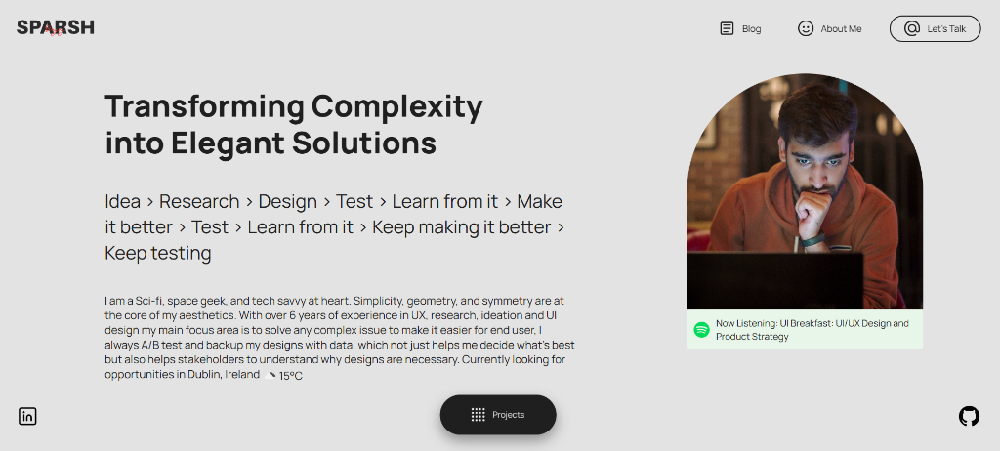

# 🌌 Sparsh Bajaj | UX Designer & Creative Developer

Welcome to my portfolio website repository! This site is designed to showcase my journey, projects, and design philosophy.

[](https://sparshbajaj.me)
[](https://www.linkedin.com/in/sparshbajaj/)

---

## 🧑‍💻 About Me

I am a Sci-fi and space geek, and a tech-savvy designer at heart. Simplicity, geometry, and symmetry are at the core of my design aesthetics. With **over 6 years of experience** in UX, research, ideation, and UI design, my main focus is solving complex user experience issues and backing my designs with data.

* 🎓 **MSc. Cyber Security** & **B.Tech Computer Science**
* 📍 **Location**: Dublin, Ireland
* 🚀 **Experience**: Agency, Startups (AI-first platforms), In-house, and Freelance
* 🧠 **Myers-Briggs**: INFJ-T

---

## 🖼️ Portfolio Preview

Here is a glimpse of the portfolio website layout:



### 💼 Featured Designs & Case Studies

|  |  |  |
| :---: | :---: | :---: |
| **MemoriaCall Brand Evolution** | **Fluence UI Design** | **Ninja UX Workflows** |

---

## 🛠️ Tech Stack & Architecture

The portfolio is built as a lightweight, performant, and responsive Single Page Application (SPA).

* **Framework**: React 19 (Concurrent features)
* **Language**: TypeScript (Type safety)
* **Bundler & Tooling**: Vite 6
* **Styling**: Styled-components & Modern CSS Modules
* **CMS Integration**: Ghost Content API (dynamically fetching case studies and blog posts)
* **SEO Engine**: Custom React hook for dynamic metadata, sitemap.xml, robots.txt
* **Analytics**: Integrated Google Analytics (gtag.js)

---

## ⚙️ Development & Getting Started

If you want to clone this repository and run the website locally, follow these steps:

### Prerequisites

Make sure you have [Node.js](https://nodejs.org/) installed.

### Installation

1. **Clone the repository**:
   ```bash
   git clone https://github.com/sparshbajaj/portfolio-2025.git
   cd portfolio-2025/react-project
   ```

2. **Install dependencies**:
   ```bash
   npm install
   ```

3. **Environment variables**:
   Copy `.env.example` to `.env` and add your API keys:
   ```bash
   cp .env.example .env
   ```
   Then edit `.env` with your keys:
   ```env
   VITE_GHOST_CONTENT_API_KEY=your_ghost_content_api_key
   VITE_APP_OPENWEATHER_API_KEY=your_openweather_api_key
   ```

4. **Start the development server**:
   ```bash
   npm run dev
   ```
   The site will be running at `http://localhost:5173/`.

5. **Build for production**:
   ```bash
   npm run build
   ```

---

## 📈 Recent Updates & Optimizations
* **Dynamic SEO Metadata**: Automatic page-specific `<title>`, description, and Open Graph tags on routing transitions.
* **Sitemap & Crawling**: Integrated `sitemap.xml` and `robots.txt` mapping both main pages and the Ghost blog subdomain.
* **Performance preloads**: Added preload links for Google Fonts to accelerate initial load time.
